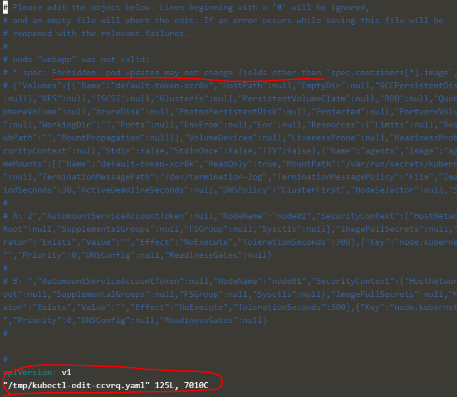
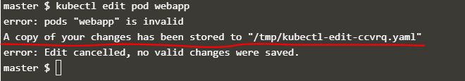

# Kubernetes

## Core Concepts:
- Architecture:
  - Worker nodes: Host application as containers
  - Master nodes: Responsible for managing, planning, scheduling and monitoring worker nodes.
    - It does this with the help of components together known as *control plane components*

  - __Control Plane Components:__
    1. ETCD cluster:
      - ETCD is a database that store information in a key:value format
    2. Kube scheduler:
      - Identifies the right node to place a container on, based on the container's resource requirements, worker node's capacity, or any other policies or constraints such as taints and tolerations or node affinity that are on them
    3. Controller Manager
      - It is the process that manages all the different controllers in a cluster.
      - In K8S, a controller is a process that continuously monitors the state of various components within the system and works towards bringing the whole system to the desired functioning state.
        - Node controller:
          - Responsible for onboarding new nodes to the cluster and handling the situations where a node becomes unavailable/ destroyed
          - It checks the status of the nodes and takes necessary actions to keep the application running	
        - Replication controller- monitors the state of replicasets and ensures that the desired number of containers are running at all times within the set/replication group. If a pod dies, it creates another one.
        
    4. Kube-apiserver: 
      - Primary management component of the cluster
      - It is responsible for orchestrating all operations within the cluster
      - It exposes the kubernetes API which is used by external users to perform management operations on the cluster, as well as the various controllers to monitor the state of the cluster and make the necessary changes as required, and by the worker nodes to communicate with the server
  
  - __Components on all nodes:__
    - Container Runtime Engine
      - The software that runs the containers
    - Kubelet
      - An agent that runs on each node in a cluster.
      - It listens for instructions from the API-server and deploys or destroys containers on the nodes as required
      - The API-Server periodically fetches status reports from the kubelet to monitor the status of nodes and containers on them
    - Kube-proxy
      - Communication between worker nodes is enabled by the kube-proxy service
      - It ensures that the necessary rules are in place on the worker nodes to allow containers running on them to reach each other

- __ETCD__
  - The ETCD data store stores regarding the cluster configuration (stores all the information about the cluster)- nodes, pods, configs, secrets, accounts, roles, bindings, etc.
  - Port 2379
  - The `etcdctl` client is a command line client for ETCD
  - Every change you make to your cluster are updated in the etcd server. Only once it is updated in the etcd server is the change considered to be complete

- __Kube API server__
  - When using the kubectl command it reaches out to the api-server. the API server then authenticates the request and validates it.
  - It then retrieves the data from the ETCD cluster and responds back with the requested information
  - eg. if trying to create a pod:
    - The Api server creates a pod object without assigning it to a node. It updates the information in the ETCD server, then updates the user that the pod has been creates
    - The scheduler continuously monitors the API server and realizes that there is a new pod with no node assigned.
    - The scheduler identifies the right node to place the new pod on and communicated that back to the api-server
    - The API server then updates the information in the etcd cluster
    - The API server then passes that information to the kubelet in the appropriate worker node
    - The kubelet then creates the pod on the node and instructs the container runtime engine to deploy the application image.
    - The Kubelet then updates the status back to the API server, and the API server then upates the data back in the ETCD server
  - A similar pattern in done every time a change is requested, because the API server is in the middle of every task that needs to be performed to make a change in the cluster
  - Kube API server is the only component that interacts directly with the ETCD data store
  - The other components use the API server to perform updates in the cluster

- __Kube Controller Manager__
  - Node controller:
    - The node controller is responsible monitoring the status of the nodes and taking necessary actions to keep the applications running, through the API server
    - It checks the status of the nodes every five seconds
      - *Node monitor period* every 5s, 
        - *Node Monitor Grace period* (waits 40s before marking unreachable) 
        - *Pod Eviction Timeout* (waits 5 minutes for it to come back up after it has been deemed unreacheable)
          - If it does not come back up, it removes the pods scheduled on that node and provisions them on the healthy nodes if they are part of a replica set.
  - Replication Controller:
    - Responsible for monitoring the status of replica sets and ensuring that the desired number of pods are available at all times within the sets. if a pod dies, it creates another one.
  - Other controllers: Service account controller, deployment controller, namespace controller, endpoint controller, job controller, PV- protection controller, PV-Binder controller, cronJob, statefulSet, replicaSet, etc
  - Display commands: `kubectl get pods -n kube-system` 
    - `ps -aux | grep kube-controller-manager`
  - By default all controllers are enabled but you can choose to enable a select few

- __Kube Scheduler__
  - The scheduler is only responsible for deciding which pod goes on which node and does not actually place the pod on the node; that is the job of the kubelet.
  - Scheduler decides where the pods are based on certain criteria.
  - Phases:
    - Filter nodes. e.g. on CPU and memory resources requested by the pod
    - Rank nodes:
      - Uses a priority function to assign a score to the nodes on a scale of 1-10
  - ** More covered in *Scheduling*
  
- __Kubelet__
  - It registers the node with a kubenetes cluster
  - When it receives instruction to load a container or a pod on the node, it requests the container runtime engine to pull the required image and run an instance
  - The kubelet then continues to monitor the status of the pod and containers in it and reports to the API server on a timely basis

- __Kube-proxy__
  - Within a cluster, every pod can reach every other pod. This is accomplished by deploying a pod networking solution to the cluster
  - A pod network is an internal virtual network that spans across all the nodes in the cluster to which all the pods connect to
  - Through this network, they are able to communicate with each other
  - Kube-proxy ensures necessary rules are in place on the worker nodes to allow the containers running on them to reach each other. Eg. An application in node1 being able to reach the database in node2.
  - It looks for new services and each time a new service is created, it creates the appropriate rules on each node to forward traffic from those services to the back-end pod eg. ip-tables rule… in this case, it creates an IP table rule on each node in the cluster to forward traffic heading to the IP of the service to the IP of the actual pod

- __Pods__
  - [pod definition file](./pod.yaml)
  - Smallest building block in k8s. It is the smallest object we can create in Kubernetes
  - It is a single instance of an application
  - There is a 1:1 relationship between pods and containers except where you have helper containers.
  - Helper containers are destroyed at the same time as the pods they are associated with. The life of a helper container is tied to the pod lifecycle.
  - The helper container and the app container communicate with each other using local host since they belong to the same network.

- Yaml Instructions:
  - You can only have name and labels and other Kubernetes acceptable information under metadata, but you can enter as many key:value descriptors under labels
  - Name and labels are children of metadata and should have the same indentation as they are siblings, but more indented than the parent

- __ReplicaSets__
  - Controllers are the processes that monitor kubernetes objects and respond accordingly.
  - Replication controller helps us to run multiple instances of a single pod in the k8s cluster, providing high availability
  - You can still use a replication controller with one pod because then the replication controller can help by automatically bringing up a new pod when the old one fails, thus ensuring that the specified number of pods is running at all times.
  - Replication controllers also help us create multiple pods to share the load across them, on different nodes as well as scale our application when the demand increases
  
  - [Replication Controller](./replication-controller.yaml)
  - [ReplicaSet](./replicaset.yaml)
  
  - Replication Controller vs. ReplicaSet
    - Both have the same purpose but they are not the same
    - RC is the older technology being replaced by RS
    - ReplicaSet requires a selector definition.
      - The selector section helps the ReplicaSet identify what pods fall under it
      - This is because RS can also manage and monitor pods that were not created as part of the RS creation. Eg. pods created before the RS that match labels specified in the selector, the replicaset will also take those pods into cosideration when creating replicas.
      - RS can be used to monitor pods that are already existing. In case they were not yet created, the Replicaset will create them for you
    - ** *Note:* RS requires a selector section, while the RC doesn’t. The RC still has one available but does not require it. It just assumes it is the same as the labels provided in the pod definition file
      - In RS, the selector has matchLabels which matches the labels specified under it to the labels on the pod
      - The RS selector also provides more options for matching labels than are available in the RC
    - RS can be used to monitor pods that are already existing. In case they were not yet created, the Replicaset will create them for you.
      - The role of the replicaset is to monitor the pods and if any of them were to fail, to deploy new ones. The Replicaset is a process that monitors the pods.
      - The labels are used as a filter for the replicaset. Under the selector section, the match labels filter has the same labels used while creating the pods, so that the RS knows which pods to monitor
      
  - Scaling a ReplicaSet
    - Update the number of replicas in the definition file and run `kubectl replace -f definition.yaml` OR  simply run `kubectl edit rs replicaSetName`, edit and save.
    - NB: when a replicaset definition file is updated, the replicaset does not automatically create new pods with the new updates. The existing pods must be deleted before the replicaset can recreate new pods with the updates. To delete all the pods, run `kubectl delete pods --all`
    - `kubectl scale --replicas=## -f definition.yaml`
    - `kubectl scale --replicas=[replicas desired] replicaset [name of RS]`- to scale on the CLI
    - NB: using the filename as an input will not automatically update the number of replicas in the definition file
      - <https://kubernetes.io/docs/reference/kubectl/conventions/>

- __Deployments__
  - [Deployment definition file](./deployment.yaml)
  - Deployments are a kubernetes object that come higher in the hierarchy that replica sets.
  - It provides us with the capability to upgrade the underlying instances seamlessly ie scale/update/replace pods with rolling update, rollbacks, pause and resume options
  - The yaml file is the same as the for the RS except for the kind
  - Once a deployment is created, it automatically creates a replicaset which in turn creates the desired number of pods as defined by the number of replicas
    - `kubectl get deploy`: display deployments created
    - `kubectl get replicaset`: to get the replicaset that is automatically created by the deployment
    - `kubectl get pods`: because the replicaset creates pods
    - `kubectl get all`  to view everything that was created at once

- __Services__
  - They enable comunication between various components within and outside the application
  - They help connect applications together with other applications or users
  - They enable connection between the users and the front-end applications, the front-end apps and backend apps, backend apps and external databases, etc., thus enabling loose coupling within our application
  - Because pods are ephemeral and sometimes get recreated on a different IP, we use a service, which is a permanent IP, so that pods do not lose communication if a pod fails and is recreated.
  - Services help to make applications discoverable within and outside of the cluster.
  - Service is a k8s object. It listens to a port on the node and forwards the requests to a port on the pod running the web application, and maps requests to the node
  - Types of service:
    - __NodePort:__ 
      - [nodeport.yaml](./node-port.yaml)
      - Outside of the cluster.  It listens to a port on the node and forwards requests to the pods. It uses the node IP and a static port to expose the container.
      - NOTE: The port on the pod where the container/application is running is known as the TargetPort while the port on the Service is simply known as the Port. 
      - The Service also has its own IP address known as the ClusterIP and the port on the node itself used to access applications in the cluster externally is known as the NodePort (range 30000-32767).
      - In case we have multiple instances of the application (pods):
        - NodePort will forward the requests to all the pods with the matching labels and selectors defined by using a *random algorithm*. 
        - As such it acts as a built-in load balancer to distribute loads across different pods on the same node and across different pods in the cluster
          ```
          Algorithm: Random
          SessionAffinity: Yes
          ```
        - K8s also creates a service that spans all the nodes in the cluster and maps the target port to the same node port on all the nodes in the cluster, making it possible to access your application using the IP of any node in the cluster, using the same port number.
        - When pods are removed/added, the service is automatically updated, making it highly flexible and adaptive.
    - __ClusterIP:__
    - [clusterIP.yaml](./clusterip.yaml)
      - Inside the cluster. The service creates a virtual service within the cluster to enable communication between the services within the cluster. Eg. front-end and back-end
      - It acts as a single interface to group and connect the pods within the cluster
      - The service can be accessed by other pods using the ClusterIP or using the service name
    - __LoadBalancer:__
    - [loadbalancer.yaml](./loadbalancer.yaml)
      - Outside of the cluster. 
      - Cloud provides a front-end to our service. Kubernetes has support for integrating with native load balancers from various cloud providers
      - Only on supported clouds like Azure, GCP, AWS
      - If set to LoadBalancer on an unsupported platform, like VirtualBox, then it would have the same effect as setting it to nodePort; it will not do any external load balancer configuration

- __Namespaces__
- [create new namespace](./namespace.yaml)
- [use namespace](./pod-namespace.yaml)
  - In Kubernetes, this is a logical isolation for resources, or virtual clusters within your k8s cluster so that resources in one isolation do not modify the resources in another
  - Kubernetes creates three namespaces by default:
    - Kube-system: for k8s system for resources that should not be deleted by mistake or interfered with. Scheduling pods on this space could mess up the whole cluster
    - Default: You can create objects in this space but other namespaces are recommended in the production env
    - Kube-public: for resources that should be made available to all users
  - The above three systems should be reserved for system usage
  - Namespace on the CLI:
    `kubectl create ns [name of namespace]`
    `kubectl delete ns [name of namespace]`
    `kubectl get pods --namespace=kube-system` or `kubectl get pods -ns kube-system` ⇒ to list pods in the kube-system namespace
  - A namespace can also be created under the pod metadata section in the manifest file to make sure it gets created under the specified namespace all the time without having to do it on the CLI
  - Creating Namespace object via definition/yaml file:
    ```   
      apiVersion: v1
      kind: Namespace
      metadata:
        namespace: dev
    ```

  - Namespaces can be used to define who can work on certain resources, the resource limits
    - Resources within the same ns can refer to each other by their hostnames
      - Eg. `mysql.connect("db-service")`
    - To connect resources in different namespaces, the namespace name must be appended to the name of the service ie `servicename.namespace.svc.cluster.local` format
      - Eg. `mysql.connect(“db-service.dev.svc.cluster.local”)`
      - `db-service` = Service Name
      - `dev` = Namespace
      - `svc` = subdomain for service
      - `cluster.local` = domain (default domain name of the k8s cluster)
    - When a service is created, a DNS is created automatically in above format
    - In order to move into a namespace permanently, eg. to dev namespace, and not have specify the namespace everytime on the CLI:
      - `kubectl config set-context $(kubectl config current-context) --namespace=dev` or use `kubens <namespace>`
        - *Contexts* are used to manage multiple clusters and multiple environments from the same management system
      - `kubectl get pods --all-namespaces`: displays all the pods in all the namespaces
  - Creating a resource quota (a resource quota helps define/allocate/limit resources in a namespace)
    - Create the resource quota and the namespace you want the RQ created in and then set the limits under spec:
        ```
        apiVersion: v1
        kind: ResourceQuota
        metadata:
          name: compute-quota
          namespace: dev
        spec:
          hard:
            pods: "10"
            requests.cpu: "4"
            requests.memory: 5Gi
            limits.cpu: "10"
            limits.memory: 10Gi
        ```
- __Imperative vs. Declarative__
  - Imperative: Gives step by step directions on how to reach the desired state
    - Run, create, expose, edit, etc 
      - Create objects
        - `kubectl run --image=nginx nginx`
        - `kubectl create deployment --image=nginx nginx`
        - `kubectl expose deployment nginx --port 80`
      - Update objects
        - `kubectl edit deployment nginx`
          - This command generates a yaml file from within the kubernetes memory, similar to the definition file used to create the object but with some additional fields such as the “status” field. You can make and save changes to this file and these changes will be applied to the live object. 
          - However, these changes will not be recorded in the original definition file(hence not recorded anywhere). 
          - Therefore, the kubectl edit command is recommended for use only when you are not going to rely on the object configuration file in the future because any subsequent changes to the object definition file will erase all changes made using the `kubectl edit` command.
          - A better approach is to first edit the object configuration file with the required changes and run `kubectl replace -f definition.yaml`. This approach ensures that the changes made are recorded and can be tracked as part of the change review process.
  - Declarative: This is done in yaml files and then with a single apply command, Kubernetes reads the configuration file and builds the infrastructure to the desired state, either to create, update, scale or bring down the infrastructure.
    - `kubectl apply -f nginx.yaml` OR `kubectl apply -f /path/to/config-files`
  - The `kubectl apply` command:
    - This will create an object if it does not already exist. If there are multiple configuration files in a directory, we can specify the directory path instead of a single file so all the configuration files are applied at once.
    - When the `kubectl apply` command is used to create a k8s object, the manifest file is converted into a json file and stored as the `Last Applied Configuration`. To make any updates on the object, the Local file (original manifest file), Last Applied Configuration (json file) and Live Object Configuration (generated using kubectl edit) are compared to identify what changes are to be made on the live object.
    - The Last Applied Configuration is stored on the Live Object Configuration file on the k8s cluster as an annotation named `kubectl.kubernetes.io/last-applied-configuration`. This section is only generated when an object is created using `kubectl apply`.

## Scheduling
- __Manual Scheduling__
  - Every Pod has a field called the `nodeName` that is not set by default. 
  - This field is automatically added by kubernetes when creating a Pod. 
  - The scheduler is then responsible for scheduling the Pods that do not have this field set.
  - Manual Scheduling: 
    - The scheduler initially goes through the pods to identify those that do not have a “nodeName” indicated(set).
    - These are the pods that need to be scheduled. 
    - The scheduler then runs the scheduling algorithm to find the right node for the pod. 
    - Once it finds the node, it schedules the pod on the node by setting the `nodeName` property to the name of the node - creating a binding object. 
  - Without a scheduler or if there are no nodes with enough resources to support the pod, the pods will remain in a pending state.
    - In that case, the easiest option would be to set the `nodeName` in the manifest file. 
    - This can only be done at creation time and K8s does not allow modification of a `nodeName` property of a pod.
  - If the pod is already created, and you want to manually assign the pod to a node: create a binding object and then send the post request to the pod’s binding API with the data set to the binding object in a json format (mimicking what the pod scheduler does)
  ```
    apiVersion: v1
    kind: Binding
    metadata:
        name: nginx
    target:
        apiVersion: v1
        kind: Node
        name: node02
  ```

  - `curl –header :Content-Type:application/json” --request POST --data ‘{“apiVersion” : “v1”, “kind”: “Binding“ ….  } http://$SERVER/api/v1/namespaces/default/pods/$PODNAME/binding`

- __Labels and Selectors:__ 
  - These are used to group and select objects. 
  - _Labels_ are defined under “metadata” in the manifest file in a key value pair format. 
  - A pod with a specific label can be selected by executing:
    - `kubectl get pods --selector [condition] app=App1` OR `kubectl get pods -A --selector=app=App1`
    - `kubectl get pods --selector env=dev --no-headers`
    - Kubernetes uses labels and selectors internally to connect different objects together eg. replicaSets and pods, services and pods etc
      - `kubectl get all --selector env=prod,bu=finance,tier=frontend`
  - NB: `kubectl get pods --selector env=dev | wc -l` will output the number of pods with selector `env=dev` (including the headers)
  - `kubectl get pods --selector env=dev --no-headers | wc -l` 

  - _Annotations:_ These are used to record other details for informative purposes e.g. tool details like name, build version, build information, contact details like phone numbers, emails, etc that might be used for some kind of integration purpose.
  
  [annotations.yaml](./annotations.yaml)
  - Attaching metadata to objects
    - You can use either labels or annotations to attach metadata to Kubernetes objects. 
    - Labels can be used to select objects and to find collections of objects that satisfy certain conditions. 
    - In contrast, annotations are not used to identify and select objects. 
    - The metadata in an annotation can be small or large, structured or unstructured, and can include characters not permitted by labels.
    - Annotations, like labels, are key/value maps:
      ```
      "metadata": {
        "annotations": {
          "key1" : "value1",
          "key2" : "value2"
        }
      }
      ```
    - Note: The keys and the values in the map must be strings. In other words, you cannot use numeric, boolean, list or other types for either the keys or the values.
      - https://kubernetes.io/docs/concepts/overview/working-with-objects/annotations/
  
- __Taints and Tolerations__
  - Taints and tolerations (not security related/cluster intrusion) are used to define what pods can be scheduled on what nodes or set restrictions on what pods can be scheduled on a node
  - By default, no pods have tolerance for a taint. As such, we have to specify which pods are going to be tolerant to a certain taint by applying toleration to the pod, allowing the pod to be scheduled on the tainted node .
  - Taints are placed on nodes and tolerations are placed on pods
    - `kubectl taint nodes node-name key=value:taint-effect`
    - E.g. `kubectl taint nodes node1 app=blue:NoSchedule`
    - `kubectl taint nodes controlplane node-role.kubernetes.io/master:NoSchedule`: will taint the controlplane node
    - To view this taint: `kubectl describe node kubemaster(controlplane) | grep Taint`
  - To untaint (Remove a taint from a node):
    - You can use kubectl taint to remove taints. You can remove taints by key, key-value, or key-effect.
    - For example, the following command removes all the taints with the dedicated key from the mynode node:
      - `kubectl taint nodes mynode dedicated-` 
      - `kubectl taint nodes controlplane node-role.kubernetes.io/master:NoSchedule-`: untaints controlplane node
  - *Taint-effect* refers to what happens to pods that do not tolerate this taint
    - There are 3 taint effects: 
        - NoSchedule: Pods will not be scheduled on the node
        - PreferNoSchedule: the system will try not to schedule on the node but not guaranteed
        - NoExecute: New pods will be scheduled and old pods will be evicted if they do not tolerate the taint.
          - The evicted pod is killed
  - Tolerations do not guarantee that the pod with the toleration will always be placed on the tainted node. 
  - The pod with the toleration can be scheduled on any of the other nodes without restrictions.
  - Taint only means that the node is only allowed to accept the pods with certain requirements (tolerations)
  - Pods are generally not scheduled on the master because k8s automatically sets a taint for pods not to be scheduled on it when the cluster is formed.
  - [tolerations.yaml](./tolerations.yaml)

- __Node Selectors__:
  - [node-selector.yaml](./node-selector.yaml)
  - Node Selectors: these are used to set limitations on pods so that they can only be scheduled on particular nodes.
  - It is indicated as a key value pair in the “spec” section of a pod and for a pod to be eligible to run on a node, the node must have each of the key value pairs as labels.
  - You label the nodes before you place the pods on them. 
  - To label nodes:
    - `kubectl label nodes <node-name> <label-key>=<label-value>`
    - `kubectl label nodes node-1 size=Large`
  - Then the pod can now be created with the same restriction as the node:
  - To verify if the label was applied successfully on a node, execute the following command:
	  - `kubectl get nodes nodeName –show-labels` OR `kubectl describe node nodeName`
  - nodeSelectors are limited where you have complex restrictions or any advanced expressions like `OR` or `NOT` like if you need to instruct k8s to place the pod on either a large OR medium node or NOT on a small node. 
    - Due to this, we then turn to *node affinity*

- __Node Affinity__
  - The primary purpose of node affinity is to ensure that certain pods are placed/hosted on certain nodes. 
  - So node affinity gives us the advanced capability to limit pod placement on specific nodes.
  - The operator can also be `NotIn` to specify which nodes not to place the pod
  - The `Exists` operator will check if the label size exists on the nodes and you don't need the label values for that... as it does not compare the values
  - Unless you are setting the size for the node affinity to anything else than small, you do not need to set a different size, this is where the `Operator:Exists` comes into play because it will not need to look for the size unless it is other than small.
  - What happens when nodeAffinity can not match the node with the given matchExpressions like the label “size”? Eg. when the pod is scheduled and someone changes the label at another time?
    - The type of node affinity defines the behavior of the scheduler with respects to the node affinity and the stages of the lifecycle of the pod
  - There are two types of node affinity in the life cycle of a pod:
    - *Currently available:*
      - requiredDuringSchedulingIgnoredDuringExecution
      - preferredDuringSchedulingIgnoredDuringExecution
    - *Planned:*
      - requiredDuringSchedulingRequiredDuringExecution
      - preferredDuringSchedulingRequiredDuringExecution
  
  - There are two states in the life cycle of a pod when considering node affinity:
    - DuringScheduling- the state where the pod does not exist and is being created for the first time
      - Required vs preferred:
        - *Required*: The scheduler doesn't run the work load unless the node affinity type label matches. That is, the pod will not be scheduled if there is no node with matching labels. Use case: Where the placement of the pod os crucial.
        - *Preferred*: this lets the scheduler know that the workload needs to be run and it is a priority. But, if the label cannot be matched, the scheduler should ignore the node affinity rules and schedule the pod on any other node.
    - *DuringExecution*- the state where a pod has been running and a change is made in the environment that affects the node affinity e.g. a change in the label of a node.
      - *Ignored*- In case an admin was to change the label eg.size, the pods will continue to run and any changes to node affinity will not affect them once scheduled
      - *RequiredDuringExecution*- (planned for the future)- this would evict any pods that do not meet the node affinity rules
  - [node-affinity.yaml](./node-affinity.yaml)

- __Node Affinity vs. Taints and Tolerations__:
  - Taints and tolerations do not guarantee that a pod must be scheduled on a particular node. A pod with a specified toleration could still end up on a node that has no taint set. On the other hand, using node affinity enables us to apply labels to the nodes and tie these nodes to pods by setting selectors. As a result, these pods will be scheduled on the right nodes but that does not guarantee that other pods (with no selector set) cannot be scheduled on these nodes.
  - Therefore, a combination of taints and tolerations, and node affinity rules can be used together to completely dedicate nodes for specific pods. That is, first use taints and tolerations to prevent other pods from being placed on the nodes, then use node affinity to ensure pods are placed on specific nodes.
  - Using a combination of both is preferred to ensure that the right pod is placed on the right node

- __Resource Requirements and Limits__:
  - Resource Requirements and Limits
  - Resource requirement- the minimum amount of CPU or memory requested by the container
  - Default: k8s assumes that a container requires 0.5CPU and 256 Mebibytes (Mi) of memory.
  - If needed these values can be changed under resources in the manifest file.
  - The values can be incremented as needed
    - 0.1 CPU = 100m  where `m` stands for milli
    - Can only go as low as 1m
    - 1 CPU = 1 AWS vCPU, 1GCP Core, 1 Azure Core, 1 Hyperthread
    - Memory:
      - 1G (Gigabyte) = 1,000,000,000 bytes
      - 1M (Megabyte) = 1,000,000 bytes
      - 1K (Kilobyte) = 1,000 bytes

      - 1Gi(Gibibyte) = 1,073,741,824 bytes
      - 1Mi(Mebibyte) = 1,048,576 bytes
      - 1Ki(Kibibyte) = 1,024 bytes
  - Kubernetes does not set a limit on the resources that a container can consume on a node, hence it can go up and consume as much resources as it requires and that suffocates the native processes on the node.
  - Limits and requests are set for each container within a pod
  
  - If a pod tries to use more resources beyond its specified limit, in the case of CPU, k8s will throttle the CPU so it doesn't go beyond the specified limit so a container cannot go above the specified CPU limit.
  - However, memory cannot be throttled. When limits are not set, when available, any pod can consume as much memory as available. The only option available to free/retrieve the memory would be to kill the pod consuming all the memory. 
  - So, if the pod constantly tries to use more than the specified memory limit, it will be terminated with an `OOM` error.
 
  - By default, does not have a CPU or memory request or limit set for pods; meaning any pod can sonsume as much resources as required on any node and suffocate other pods or processes that are running on the node of resources
  - ** Ideal: At least set requests if you do not set limits; that is the only way a pod will have resources guaranteed when there are no limits set for other pods.
  - [Resource Limits.yaml](./resource-limits.yaml)
  - [Resource Requests.yaml](./resource-requests.yaml)
  - [Resource Quota.yaml](./resource-quota.yaml)

  - How do we ensure that every pod created has some default set?
    - This is possible with *limit ranges*. Limit ranges can help you define default values to be set for containers in pods that are created without a request or limit specified in the pod-definition files. This is applicable at the namespace level
    - Note: These limits are enforced when a pod is created. So if you create or change a limit range, it does not affect existing pods, only those created after the limit range is created or updated
  
  - Is there a way to erstrict the total amount of resources that can be consumed by applications deployed in a Kubernetes cluster? e.g. all pods together should not consume more that a certain amount of CPU or memory...
    - We can create quotas at a namespace level.
    - A resource quota is a namespace level object that can be created to set hard limits for requests and limits
    
  - Resources:
    - <https://kubernetes.io/docs/tasks/administer-cluster/manage-resources/memory-default-namespace/>
    - <https://kubernetes.io/docs/tasks/administer-cluster/manage-resources/cpu-default-namespace/>
    - <https://kubernetes.io/docs/tasks/configure-pod-container/assign-memory-resource>
      ```
      apiVersion: v1
      kind: LimitRange
      metadata:
      name: mem-limit-range
      spec:
      limits:
      - default:
          memory: 512Mi
        defaultRequest:
          memory: 256Mi
        type: Container
      ```

      ```
      apiVersion: v1
      kind: LimitRange
      metadata:
      name: cpu-limit-range
      spec:
      limits:
      - default:
          cpu: 1 
        defaultRequest:
          cpu: 0.5
        type: Container
      ```
  - The status `OOMKilled` indicates that it is failing because the pod ran out of memory. Identify the memory limit set on the POD.
  
  - We cannot edit the “spec” of a running pod using the `kubectl edit pod podName` command. This will output an error but it will temporarily store the changes in the temp directory (`/tmp/kubernetes-edit-xxxxxxx.yaml`). This file can be used to recreate the pod using the `kubectl replace -f  /tmp/kubernetes-edit-xxxxxxx.yaml --force` which will automatically delete the existing pod and recreate it.
  
  - A quick note on editing PODs and Deployments
    - Edit a POD:
      - Remember, you CANNOT edit specifications of an existing POD other than the below.
      `spec.containers[*].image`
      `spec.initContainers[*].image`
      `spec.activeDeadlineSeconds`
      `spec.tolerations`
      - For example, you cannot edit the environment variables, service accounts, resource limits of a running pod. But if you really want to, you have 2 options:
      1. Run the `kubectl edit pod <pod name>` command.  This will open the pod specification in an editor (vi editor). Then edit the required properties. When you try to save it, you will be denied. This is because you are attempting to edit a field on the pod that is not editable. A copy of the file with your changes is saved in a temporary location in the /tmp folder.
       
       
         - You can then delete the existing pod by running the command: `kubectl delete pod webapp`
         - Then create a new pod with your changes using the temporary file: `kubectl create -f /tmp/kubectl-edit-ccvrq.yaml`
      2. The second option is to extract the pod definition in YAML format to a file using the command: `kubectl get pod webapp -o yaml > my-new-pod.yaml`
         - Then make the changes to the exported file using an editor (vi editor). 
         - Save the changes
           `vi my-new-pod.yaml`
         - Then delete the existing pod: `kubectl delete pod webapp`
         - Then create a new pod with the edited file:
         `kubectl create -f my-new-pod.yaml`
    
    - Edit Deployments
      - With Deployments you can easily edit any field/property of the POD template. Since the pod template is a child of the deployment specification,  with every change the deployment will automatically delete and create a new pod with the new changes. So if you are asked to edit a property of a POD part of a deployment you may do that simply by running the command: `kubectl edit deployment my-deployment`

- __DaemonSets__
  - It allows you to create multiple instances of your pods but it runs one copy of your pod on each node in your cluster. 
  - Whenever a new node is added to the cluster, a replica of the pod is automatically added to that node and when a node is removed from the cluster, the pod is automatically deleted
  - A daemonSet ensures that one copy of the pod is always present in all the nodes in the cluster
  - Use cases: 
    - Monitoring agent/ monitoring solution / log viewer 
    - Kube-proxy
    - Networking solution like weave-net
  - It looks like a replicaSet except for the kind is a DaemonSet
  - `kubectl get daemonsets`
  - `kubectl describe daemonsets [name of daemonset]` → `kubectl describe daemonsets monitoring-daemon`
  - How does it work?
    - Before v1.12: Set the nodeName property to bypass the scheduler and get the pod placed on a node directly
    - After v1.12: Uses the default scheduler and node affinity rules to schedule pods on nodes
  - [DaemonSet](./daemonset.yaml)

- __Static Pods__
  - Static pods are pods created by kubelet on its own without the intervention of the API server or the rest of the k8s cluster components. 
  - That is, the kubelet is configured to read pod definition files from a directory on the server designated to store information about pods (`/etc/kubernetes/manifests`). 
  - The kubelet will periodically check this directory, read these files, create the pods on the hosts and ensure that the pods stay alive. The kubelet also attempts to restart the application if it crashes and it will recreate the pod if any changes are made to the definition files
  - Pods are created using manifest files placed in `/etc/kubernetes/manifests` by kubelet- only pods can be created this way, not replicaSets/DaemonSets/Deployments/Services. If a file is removed from this directly, the pod is also deleted automatically and cannot be recreated
  - `kubectl run --restart=Never --image=busybox static-busybox --dry-run=client -o yaml --command -- sleep 1000 > /etc/kubernetes/manifests/static-busybox.yaml`
  - The kubelet works at a pod level and can only understand pods
    - `--pod-manifest-path=/etc/kubernetes/manifests`
  - Can also configured by setting a path with the config option: `--config=kubeconfig.yaml` and in the yaml file set the staticPodPath
  - Clusters set up by the kubeadm tool use this approach
  - Once the static pods are created, they can be viewed by executing the `docker ps` → this because the rest of the cluster does not exist i.e. there is no apiServer for the kubelet to interact with.
  - The kubelet can create both the static pods and the ones from the kube-apiserver (provides an http endpoint to provide an input to the kubelet) at the same time.
  - Is the apiserver aware of the static pods created by the kubelet? 
    - Yes, when the kubelet creates a static pod, if it is a part of the cluster then it also creates a mirror object in the kube-apiserver. What is observed on the apiserver (kubectl get pods) is just a read-only mirror of the pod(cannot be edited or deleted). The name of a static pod is automatically appended by the node name e.g. “static-web-node01”
  - Use case:
    - Because static pods are not dependent on the k8s control plane, static pods can be used to deploy the components of the control plane itself as pods on a node. That is, install kubelet on all the master nodes, create pod definition files that use Docker images of the various controlplane components such as the apiserver, controller, etcd etc, place the definition files in the designated manifest folders and the kubelet will take care of deploying the controlplane components as pods on the cluster. If any of these services were to crash, it will automatically be restarted by the kubelet since it's a static pod.
  - To get the path of the static pods manifest files, run the command: `cat /var/lib/kubelet/config.yaml`
  - Diff between static pods and Daemonsets:
    - Static pods are: 
      - Created by the kubelet without help from the kube-apiserver
      - Deploy control plane components as static pods
    - DaemonSets are:
      - Created by the kube-apiserver (DaemonSet controller) through the kube-api-server
      - Deploy monitoring agents, logging agents on nodes
    - Both static pods and daemonsets are ignored by the kube-scheduler

- __Multiple Schedulers__
  - Kubernetes allows us to write a custom scheduler program, package and deploy it as the default scheduler or as an additional scheduler in the kubernetes cluster. 
    ```scheduler-config.yaml
    apiVersion: kubescheduler.config.k8s.io/v1
    kind: KubeSchedulerConfiguration
    profiles:
    - schedulerName: default-scheduler
    ``` 
  - Also, a kubernetes cluster can have multiple schedulers at the same time. 
    ```my-scheduler-1-config.yaml
    apiVersion: kubescheduler.config.k8s.io/v1
    kind: KubeSchedulerConfiguration
    profiles:
    - schedulerName: my-scheduler-1
    ``` 
    ```my-scheduler-2-config.yaml
    apiVersion: kubescheduler.config.k8s.io/v1
    kind: KubeSchedulerConfiguration
    profiles:
    - schedulerName: my-scheduler-2
    ```  
  - As a result, when creating a Pod or Deployment, you can instruct kubernetes to have the Pod scheduled by a specific scheduler.
  - To deploy an additional scheduler, you can use the same kube-scheduler binary or use one that you have built for yourself. The kubeadm tool will normally deploy the default scheduler as a Pod (pod definition file located at `/etc/kubernetes/manifests`). 
    - A custom scheduler can be created by making a copy of the default scheduler’s pod definition file and changing the name of the scheduler (e.g. my-custom-scheduler). Add a new option to the scheduler command to set a custom name for the scheduler.

  - *leader-elect* - this is an option that is used when you have multiple copies of the scheduler running on different master nodes e.g in a high availability setup where there are multiple master nodes with the kube-scheduler process running on all of them. 
    ```my-scheduler-1-config.yaml
    apiVersion: kubescheduler.config.k8s.io/v1
    kind: KubeSchedulerConfiguration
    profiles:
    - schedulerName: my-scheduler-1
    leaderElection:
      leaderElect: true
      resourceNamespace: kube-system
      resourceName: lock-object-my-scheduler
    ``` 
    - If multiple copies of the scheduler are running on different nodes, only one can be active at a time. So the leader-elect option helps in choosing a leader who will lead scheduling activities. 
    - To get multiple schedulers working, the leader-elect option must be set to false (`- --leader-elect=false`) if there are no multiple master nodes. 
    - If there are multiple master nodes, an additional parameter can be passed to set a lock object name (`- --lock-object-name=my-custom-scheduler`) which will differentiate the new custom scheduler from the default during the leader election process.
    - <https://kubernetes.io/docs/tasks/extend-kubernetes/configure-multiple-schedulers>
  - To configure a new Pod or deployment to use the custom scheduler, add a new field in the pod/deployment definition file called `schedulerName` and specify the name of the scheduler (`schedulerName: my-custom-scheduler`).
    ```
    apiVersion: v1
    kind: Pod
    metadata:
      name nginx
    spec:
      containers:
      - image: nginx
        name: nginx
      schedulerName: my-custom-scheduler
    ```
  - To know which scheduler picked up the scheduling of a Pod, view events by executing the `kubectl get events` command.
  - To view the logs of the scheduler, view the logs of the Pod:`kubectl logs <schedulername> <namespace>` e.g. `kubectl logs my-custom-scheduler –n kube-system`

- __Configuring Scheduler Profiles__
  - When pods are first created they end up in a scheduling queue. 
    - At this point, pods are sorted based on the priority defined on the pods
    - To set a priority, you must first create a priority class with a priority name and priority value
  - Then the pods enter a filtering phase:
    - This is where the nodes that cannot run the pod are filtered out
    - e.g. the amount of resources needed for the pod
  - Scoring phase:
    - This is where nodes are scored with different weights
    - It assigns a higher score to the nodes based on how many resources are left in the node after the pod is placed
  - Binding phase:
    - This is where the pod is finally bound to a node with the highest score
  
  - All these operations are achieved with certain plugins
  - ** A single plugin can be associated with different phases
    - In the scheduling queue, the *PrioritySort* plugin sorts the pods in order based on the priority configured on the pods. This is how pods with a priorityClass get higher priority over the other pods when scheduling
    - In the filtering phase, the *NodeResourcesFit* plugin identifies the nodes that have sufficient resources required by the pods and filters out the nodes that do not.
      - *NodeName* plugin: checks if a pod has a node name mentioned in the pods spec, and filters out the nodes that do not match the given name
      - *NodeUnschedulable* plugin: filters out nodes that have the unschedulable flag set to true (`Unschedulable: true`); when you place on the cordon command on a node. this plugin makes sure that the nodes with this flag do not have pods set on them.
        ```
        Taints: node.kubernetes.io/unschedulable:NoSchedule
        Unschedulable: true
        ```
    - In the scoring phase, the *NodeResourcesFit* plugin associates a score to each node based on the resources that will be available on it after the pod is placed on it.
      - *ImageLocality* plugin: Associates a high score to the nodes that already have the container image used by the pods among the different nodes
    - NOTE: At this phase, the plugins do not really reject the pod placement on a particular node. For example, in the case if the ImageLocality plugin, it ensures that pods are places on a node that already has the image, but if there are no nodes available, it will anyway place the pod on a node that does not have the image, so only scoring is happening at this stage
    - In the binding phase, the *DefaultBinder* plugin provides the binding mechanism
  
  - K8s allows to customize where what plugins go where, how they are names and for us to make custom plugins.
  - This is achieved with *extension points*. At each stage/phase there is an extension point to which a plugin can be plugged into.
  <table>
  <tr>
    <td>Phase</td>
    <td>Plugins</td>
    <td>Extensions</td>
  </tr>
  <tr>
    <td>Scheduling Queue</td>
    <td>- PrioritySort<br>-NodeResourcesFit<br>NodePorts</td>
    <td>- queueSort</td>
  </tr>
  <tr>
    <td>Filtering</td> 
    <td>- NodeResourcesFit<br>- NodeName<br>- NodeUnschedulable<br>- TaintToleration<br>- NodePorts<br>- NodeAffinity</td>
    <td>- PreFilter<br>- filter<br>- postFilter</td>
  </tr>
  <tr>
    <td>Scoring</td>
    <td>- NodeResourcesFit<br>- ImageLocality<br>- TaintToleration<br>- NodeAffinity</td>
    <td>- preScore<br>- score<br>- reserve</td>
  </tr>
  <tr>
    <td>Binding</td>
    <td>- DefaultBinder</td>
    <td>- permit<br>- preBind<br>- bind<br>- postBind</td>
    </tr>
</table>

  - You can get custom code to run anywhere in these extension point by just creating a plugin and plugging it into the respective extension point you would like to.
  - How to change the default plugin behavior:
    - If we create our own schedulers, they will have their own separate scheduler binaries that are run with separate scheduler config files. 
    - Limitations: 
      - Given that these are separate processes, there is more work to maintain them.
      - The schedulers they may also run into race conditions while making scheduling decisions. eg. a scheduler may schedule a workload on a node without knowing that another node is doing the same on that same node at the same time
    - With v1.18, a feature to support multiple profiles in a single scheduler was introduced. 
      - This enables us to configure multiple profiles within a single scheduler in the configuration file by adding more entries to the list of profiles, and for each profile, specify a separate scheduler name. 
      - This creates a separate profile for each scheduler, which acts as a separate scheduler itself, except now, there are multiple schedulers in the same binary, as opposed to creating separate binaries for each scheduler

      ```scheduler-config.yaml
      apiVersion: kubescheduler.config.k8s.io/v1
      kind: KubeSchedulerConfiguration
      profiles:
      - schedulerName: my-scheduler-1
      - schedulerName: my-scheduler-2
      - schedulerName: my-scheduler-3
      - schedulerName: my-scheduler-4
      ``` 
    - Configuring the scheduler profiles to work differently:
      - Under each profile, we can customize the plugins
      - [Customized Scheduler Profiles](./customized-scheduler-profiles.yaml)
    - References:
      - <https://kubernetes.io/docs/concepts/scheduling-eviction/scheduling-framework>
      - <https://github.com/kubernetes/enhancements/tree/master/keps/sig-scheduling/1451-multi-scheduling-profiles>
      - <https://github.com/kubernetes/community/blob/master/contributors/devel/sig-scheduling/scheduling_code_hierarchy_overview.md>
      - <https://kubernetes.io/blog/2017/03/advanced-scheduling-in-kubernetes/>
      - <https://jvns.ca/blog/2017/07/27/how-does-the-kubernetes-scheduler-work>
      - <https://stackoverflow.com/questions/28857993/how-does-kubernetes-scheduler-work>

## Logging and monitoring
- Monitoring in a kubernetes cluster can revolve around knowing the *node level metrics* such as the number of nodes in a cluster; how many of them are healthy as well as *performance metrics* such as CPU, Memory, Network and Disk utilization.
- Also we can monitor *Pod level* metrics such as the number of pods and *performance metrics of each Pod* such as CPU and Memory consumption on them.
- Kubernetes does not come with a full featured built-in monitoring solution, it relies on open-source solutions such as Metrics-Server, Prometheus, ElasticStack and proprietary solutions like Datadog and Dynatrace.
- Monitor cluster components
  - Metrics Server: you can have one metric server per k8s cluster
    - The metrics server retrieves metrics from each of the k8s nodes and pods, aggregates them and store them in-memory
    - Metrics server is only an in-memory monitoring solution and does not store the metrics on the disk and as a result, you cannot see historical performance data.
  - How k8s generates metrics:
    - K8s runs an agent on each node known as the kubelet, responsible for receiving instructions from the kubernetes API master server and running pods on the nodes
    - The kubelet also contains a sub component known as the CAdvisor (Container advisor)- responsible for retrieving performance metrics from pods and exposing them through the kubelet api to make the metrics available for the metrics server
    - For minikube execute `minikube addons enable metrics-server`
    - For all other all other environments, deploy the metrics server by cloning the metrics server deployment files from the github repository: `git clone https://github.com/kubernetes-incubator/metrics-server.git` and then deploy the required components
      - `kubectl create -f deploy/1.8+/`
      - `kubectl top node`: to view memory and CPU usage
      - `kubectl top pod`: to view performance metrics of pods
  - Application Logs
    - Application logs can be viewed using the `kubectl logs [podName]`
      - e.g. `kubectl logs -f event-simulator-pod [containerName]`
      - The `-f` option helps us to stream the log live. 
      - These logs are specific to the container running on the pod.
    - In case you have more than one container, you need to specify the name of the container you want to generate its logs i.e. `kubectl logs -f [podName] [containerName]`
    - [loadbalancer.yaml](./loadbalancer.yaml)

## Application Lifecycle Management
  - Rolling Updates and Rollbacks in a Deployment
  - To view rollout status:
   `kubectl rollout status deployment/<Name of deployment>` e.g. `kubectl rollout status deployment/myapp-deployment`
  - To view revision history: 
  `kubectl rollout history deployment/myapp-deployment`

- __Deployment strategies:__
  - *Recreate*: kill all pods and then bring up the new versions. 
    - Not recommended as the app goes down and is completely inaccessible to end-users during the deployment
    - Not the default deployment strategy
    - `kubectl describe deployment <Name of Deployment>` will show that it scaled down all the way to zero then brought the pods back up with the new version
  - *Rolling update*: only takes down the specified percentage of the pods down as it brings up the new version of the application. 
    - Default deployment strategy.
    - `kubectl describe deployment <Name of Deployment>` will show that the deployment scaled down and up, one at a time

- __Upgrades and rollbacks:__
  - Updating a Deployment could mean updating the application version by updating the version of Docker containers used, updating their labels or updating the number of replicas etc.
  - These updates can be affected by simply editing the deployment definition file and re-running the `kubectl apply -f deployment.yml` command. 
  - Alternatively, we can update the image in a Deployment (container image) by executing ⇒ `kubectl set image deployment/deploymentName` 
    - e.g. `kubectl set image deployment/myapp-deployment nginx=nginx:1.9.1`. This will update the image of the deployment configuration but it will not update the new image in the deployment definition file, so be careful when using the same definition file to make changes in the future.

  - When a new deployment is first created, it first of all creates a replicaset automatically which in turn creates the number of pods required as defined by the number of replicas. 
  - When a new version of the deployment is rolled out, the kubernetes deployment object creates a new replicaset and starts deploying the containers while at the same time bringing down the pods of the old replicaset following a rolling update strategy. 
    - `kubectl get replicasets`
  - When you rollback a deployment, the deployment will then destroy the pods in the new replicaset and bring the older ones up in the old replicaset, and your application goes back to its older format

  - Kubernetes allows for us to go back to an older version of the application by undoing the rollout: `kubectl rollout undo deployment/<Name of Deployment>`
  - Command Summary:
    - `kubectl create -f deployment-definition.yml`
    - `kubectl get deployments`
    - `kubectl apply -f deployment-definition.yml`
    - `kubectl set image deployment/deploymentName containerName=newImage` 
      - e.g. `kubectl set image deployment/my-app-deployment nginx=nginx:1.9.1` ( this will not update the image in the definition file)
    - `kubectl rollout status deployment/my-app-deployment`
    - `kubectl rollout history deployment/my-app-deployment`
    - `kubectl rollout undo deployment/my-app-deployment`

- __Configuring Applications__
  - Unlike virtual machines, containers are not meant to host an operating system. They are meant to run a specific task or process such as to host the instance of a web server or application server or a database, or simply to run some computation or analysis, etc. Once the task is complete, the container exits. The container only lives as long as the process inside it is alive.
  - The reason an Ubuntu container will die is because for this container the CMD is [“bash”] which is not a process but a shell which listens for inputs from a terminal and since it cannot find a terminal, it exits.
  - By default, docker does not attach a terminal to a container when it is run and so the bash program does not find a terminal, hence it exits.
  - Overriding the CMD - How to specify a different command to start the container:
    1. Append a command to the `docker run` command so that it can override the default command specified within the image e.g. `docker run ubuntu [command]` ... `docker run ubuntu sleep 5`
    2.  Making the change permanent, make the change in the docker file:
       ```
       FROM Ubuntu
       CMD sleep 5
       ``` 
      - There are different ways of specifying the command:
        - In shell form: 
          - `CMD command param1` e.g. `CMD sleep 5`
        - or in a JSON array format:
          - `CMD ["command", "param1"]` e.g. `CMD ["sleep", "5"]`
          - Note**:
            - In the JSON array format, the first element in the array should be executable, e.g. `"sleep"`
            - The command and its parameters should be separate elements in the list
    - In case you want to later change the parameters again, you can use the ENTRYPOINT because then you only have to use the paramters on the CLI
      - e.g. instead of `docker run ubuntu sleep 15` you can run: `docker run ubuntu 10`
      ```
      FROM Ubuntu
      ENTRYPOINT ["sleep"]
      ```
    - The ENTRYPOINT instruction is like the CMD instruction in the you can specify the command that will be run when the container starts
    - Whatever is specified on the command like will get appended to the entrypoint
    - 

- __ENTRYPOINT and CMD__
  - The ENTRYPOINT is the executable while the CMD is the parameter.
  - When writing the CMD in executable format, enter it in JSON format, the executable comes first, then the parameter second eg.: `[“sleep”, “10”]`
  - Shell format: `CMD sleep 10`
  - The difference between `CMD` and `ENTRYPOINT` is that the former gets replaced entirely if a different parameter is entered at the CLI while the CLI ad-hoc parameters are appended to the `ENTRYPOINT`.
  - In case the time is not set on the CLI, and it is not specified by the `ENTRYPOINT` ([“sleep”]), then k8s will show there is a missing operand.
  - To set a default value, then your `CMD` will be passed as an argument/parameter to the `ENTRYPOINT`: 
    ```
    ENTRYPOINT [“sleep”]
    CMD [“10”]
    ```
    - If this is not changed on the CLI, then the parameter stays the same. If it is changed on the CLI, then the parameter will override the command instruction. Ps. for this to happend, the command and entrypoint always have to be expressed in a JSON format
  - Modifying the ENTRYPOINT at run time:
    - You can use the `--entrypoint` option in the docker run command:
      - `docker run --entrypoint sleep2.0 ubuntu-sleeper 10`. The final command at startup then becomes `docker run sleeper2.0 10`

- __Application Commands and Arguments__
  - In the yaml file, the parameter/ `CMD`is entered under “args” while the `ENTRYPOINT` is entered under command. 
  - That is, the `CMD` in a Dockerfile is overridden by `args` in a pod definition file while the `ENTRYPOINT` in a Dockerfile is overridden by `command` in a pod definition file.
  - [Commands and Arguments:](./commands-argument.yaml)

- __Configure Environmental Variables in Applications__
  1. Use the `env` property to set an environmental variable in a plain key-value format. 
  - `env` is an array so, each item under the env property starts with a dash, indicating it is an item in the array.
  - Each item has a name and a value property e.g.
    ```
    env:
      - name: APP_COLOR
        value: pink
    ```
  - The `name` is the name of the environmental variable made available with the container and the `value` is its value on the CLI. eg. `APP_COLOR=pink`. 
  -  [env.yaml](./env.yaml)
  
  2. These environmental variables can also be applied using *configmaps*. In this case, instead of specifying the `value` we will have `valueFrom` followed by a specification of configmap or secret.

      ```
      # ConfigMap: (plain-text)
        env:
          - name: APP_COLOR (config map)
            valueFrom:
              configMapKeyRef: "..."
      ```
      ```
      # Secrets: (base64 encoded)
      env:
        - name: APP_COLOR (secret)
          valueFrom:  
            secretKeyRef: "..."
      ```

- __Configuring ConfigMaps in Applications__
  - ConfigMaps are used to pass configuration data in the form of key-value pairs in kubernetes. 
  - When pods are created, inject the configmap into the pod so the key-value pairs  are available as environmental variables for application hosted in the container. 
  - The configmap is created first before it is injected into Pods.
  1. Create the configMap
      ```
      ConfigMap:
        APP_COLOR: blue
        APP_MODE: prod
      ```
  2. Inject into the pod
    ```
    envFrom:
    - configMapRef:
        name:
    ```
  
  - Configmaps can be created in two ways: imperatively and declaratively
    - Imperatively: 
      - No configMap definition file is used
        - `kubectl create configMap <configName> --from-literal=<key>=<value>`
      - NB: The `--from-literal` is used to specify the key value pairs in the command itself. 
        - If you have additional key value pairs, simply specify the `--from-literal` option multiple times. 
        - `kubectl create configmap \app-config --from-literal=APP_COLOR=blue --from-literal=APP_MODE=prod`
        - However, this will get complicated when there are too many configuration items.

      - Alternatively, we can input configuration data through a file using the `--from-file` option to specify the path to the file that contains the required data.
        - `kubectl create configmap <config-name> --from-file=<path-to-file>`
        - `kubectl create configmap app-config --from-file=app_config.properties`

    - Declaratively: uses a ConfigMap definition file
      - The file has an apiVersion, Kind, metadata and `data` instead of `spec`
      ```
      #configMap.yaml:
      apiVersion: v1
      kind: ConfigMap
      metadata:
        name: app-config
      data:
        APP_COLOR: blue
        APP_MODE: prod
      ```

        - `kubectl create -f <fileName>`
        - `kubectl create -f configMap.yaml`
        - You can create as many configmaps as needed. Just make sure to label each one appropriately as these names will be needed when associating the configmap with the pods
        - To view the configmaps: 
          - `kubectl get configmaps`
          - `kubectl describe configmaps`: this commands lists the config data as well as the data section

      - Configure configMap with pod:
        - To inject an environmental variable into a Pod definition file, simply add a new property to the container called `envFrom`. 
        - The envFrom property is a list, so we can pass as many environmental variables as required. 
        - Each item in the list corresponds to a configMap item. 
        - Specify the name of the configMap you created earlier to inject the configMap

        ```
        # pod-definition.yaml:
        apiVersion: v1
        kind: Pod
        metadata:
          name: simple-webapp-color
        spec:
          containers:
          - name: 
            envFrom:
              - configMapRef:
                  name: app-config # (name of the configMap)
        ```
        - [See pod with configmap.](./pod-with-configmap.yaml)

    - NB: There are other different ways to inject configuration data into pods:
    1. As a Single Environmental Variable:
      ```
        env:
        - name: APP_COLOR (config map)
          valueFrom:
            configMapKeyRef:
              name: app-config
              key: APP_COLOR
        ```
    2. As files in a volume:
      ```
        volumes:
          - name: app-config-volume
            configMap:
              name: app-config
      ```

- __Configuring Secrets__
  - Secrets are used to store sensitive information like passwords or keys. They are similar to configmaps except that they are stored in an encoded/hashed format.
  - Consider this [app.py](./app.py) file. The secret is hardcoded and that is not secure. It could be read as an env. variable from a configMap (CM) file, but CMs are plain text, so this can be imported from a secret.
  - Secrets are used to store sensitive information like passwords or keys. They are similar to configMaps except that they are stored in an encoded format
  
      ```
      DB_Host: mysql ⇒ bXlzcWw=
      DB_User: root ⇒ cm9vdDA==
      DB_Password: paswrd ⇒ cGFzd3Jk
      ```
  - There are two steps involved in creating a secret. Create the secret then inject it into the pod
  - There are also two ways of creating a secret in kubernetes: imperatively and declaratively
    - Imperative - without using a configuration file
      - The key value pairs can be specified in the commandline ie.
        - `kubectl create secret generic <secret-name> --from-literal=<key>=<value>`
        - Example:
          ``` 
          kubectl create secret generic \
          app-secret --from-literal=DB_Host=mysql \
          --from-literal=DB_User=root
          --from-literal=DB_Password=paswrd
          ```
        - OR:
        - Use the `--from file` option
          - `kubectl create secret generic <secret-name> --from-file=<path-to-file>`
          - `kubectl create secret generic app-secret --from-file=/app_secret.properties`

  - Declarative - using a secret-definition/configuration file
    - The file has an apiVersion=v1, Kind=Secret, metadata=specify name and “data” instead of “spec”. 
      ```
      # secret-data.yml
      apiVersion: v1
      kind: Secret
      metadata:
        name: app-secret
      data:
        DB_Host: mysql
        DB_User: root
        DB_Password: paswrd
      ```
    - This is however still not safe as the data is still in plain text. As such, we need to encode it:
    - On a linux host, run a base-64 encoding for the data you are trying to encode. Eg.
        - `echo -n ‘mysql’ | base64` ⇒ bXlzcWw=
        - `echo -n ‘root’ | base64` ⇒ cm9vdDA==
        - `echo -n ‘paswrd’ | base64` ⇒ cGFzd3Jk
        - `kubectl get secrets`
        - `kubectl describe secrets`: displays the secrets with the values hidden
        - `kubectl get secret app-secret -o yaml`: to view the secret’s values
    - To decode the hash value, use the same base64 and append `--decode`:
      - `echo -n ‘bXlzcWw=’ | base64 --decode` ⇒ mysql or `echo -n ‘bXlzcWw=’ | base64 -d` ⇒ mysql

- Inject into the Pod. Examples:
  ```
  apiVersion: v1
  kind: Pod
  metadata:
    name: simple-webapp-color
  spec:
    containers:
      - name: simple-webapp-color
        image: simple-webapp-color
        ports:
        - containerPort: 8080
        envFrom:
        - secretRef:
            name: app-secret
  ```
  ```
  apiVersion: v1
  kind: Pod
  metadata:
    labels:
      name: webapp-pod
    name: webapp-pod
    namespace: default
  spec:
    containers:
    - image: kodekloud/simple-webapp-mysql
      imagePullPolicy: Always
      name: webapp
      envFrom:
      - secretRef:
          name: db-secret
      resources: {}
  ```
  
  - There are other different ways of injecting secrets into pods:
    - Single env
      ```
      env:
      - name: DB_Password
        valueFrom:
          SecretKeyRef:
            name: app-secret
            key: DB_Password
      ```
    - Mounted as files in a volume where each attribute in the secret is created as a file with the value of the secret as its content:
    ```
    volumes:
      - name: app-secret-volume
        secret:
          name: app-secret
    ```
      - When you mount the secret as a volume in the pod, each attribute in the secret is created as a file with the value of the secret as its content:
      ```
      ⇒ ls /opt/app-secret-volumes
      DB_host  DB_Password  DB_user
      ```
      ```
      ⇒ cat /opt/app-secret-volumes/DB_Password
      Paswrd
      ```
      - 
- __A note about Secrets!__
  - The concept of safety of the Secrets is a bit confusing in Kubernetes. The kubernetes documentation page and a lot of blogs out there refer to secrets as a "safer option" to store sensitive data. They are safer than storing in plain text as they reduce the risk of accidentally exposing passwords and other sensitive data. It's not the secret itself that is safe, it is the practices around it.
    - Remember that secrets are not encrypyted. They are only encoded data in base64 format. Anyone with the base64 encoded secret can easily decode it. As such the secrets can be considered as not very safe.
      - Do not check-in secret objects to SCM along with the code
    - Secrets are not encryoted in ETCD (none of the daa in ETCD is encryoted by default).
      - Consider using enabling [encryption at rest](https://kubernetes.io/docs/tasks/administer-cluster/encrypt-data/).
    - Anyone able to create pods/deployment in the same namespace can access the secrets
      - Configure least-privilege access to Secrets - RBAC
    - Consider 3rd-party secrets store providers like AWS Secret Manager, Azure Key Vault, GCP Secret Manager, Hashicorp Vault ... so that the secrets are not sored in the ETCD but in an external secret provider
    - Also the way kubernetes handles secrets. Such as:
      - A secret is only sent to a node if a pod on that node requires it.
      - Kubelet stores the secret into a tmpfs so that the secret is not written to disk storage.
        - Once the Pod that depends on the secret is deleted, kubelet will delete its local copy of the secret data as well.
  - References:
    - [Secrets](https://kubernetes.io/docs/concepts/configuration/secret/)
    - [Secret Store CSI Driver Tutorial](https://www.youtube.com/watch?v=MTnQW9MxnRI)

- __Encrypting Secret Data at Rest__
  - References:
    - [Encrypt Data at Rest](https://kubernetes.io/docs/tasks/administer-cluster/encrypt-data/)
    - [Encrypt with KMS v2](https://kubernetes.io/docs/tasks/administer-cluster/kms-provider/#configuring-the-kms-provider-kms-v2)
  - Note: After encryption is enabled, only new secrets will be encrypted. But if you update an exising configuration, then that will be encrypted.
    - Replacing the secrets with the same data to encrypt it:
      - `kubectl get secrets --all-namespaces -o json | kubectl replace -f -`
      - This will then update the secrets and so they will be encrypted in the ETCD

- __MultiContainer pods__
  - Multi-container PODs Design Patterns:
  - They share the same life-cycle, network (they can refer to each other as localhost) as well as volumes.
  - There are 3 common patterns, when it comes to designing multi-container PODs: *side car pattern*, *adapter pattern* and the *ambassador pattern*.

  - __InitContainers:__
    - In a multi-container pod, each container is expected to run a process that stays alive as long as the POD's lifecycle. For example in the multi-container pod that we talked about earlier that has a web application and logging agent, both the containers are expected to stay alive at all times. The process running in the log agent container is expected to stay alive as long as the web application is running. If any of them fails, the POD restarts.
    - But at times you may want to run a process that runs to completion in a container. For example a process that pulls a code or binary from a repository that will be used by the main web application. That is a task that will be run only one time when the pod is first created. Or a process that waits for an external service or database to be up before the actual application starts. That's where initContainers comes in.
    - An initContainer is configured in a pod like all other containers, except that it is specified inside an initContainers section, like this: [init-container.yaml](./initContainer.yaml)

  - When a POD is first created the initContainer is run, and the process in the initContainer must run to a completion before the real container hosting the application starts. 
  - You can configure multiple such initContainers as well, like how we did for multi-pod containers. In that case each init container is run one at a time in sequential order.
  - If any of the initContainers fail to complete, Kubernetes restarts the Pod repeatedly until the Init Container succeeds.
    - [multi-init-containers.yaml](./multi-initContainers.yaml)

  - References:
    - [initContainers](https://kubernetes.io/docs/concepts/workloads/pods/init-containers/) 

- __Self healing applications:__
  - Kubernetes supports self-healing applications through ReplicaSets and Replication Controllers. The replication controller helps in ensuring that a POD is re-created automatically when the application within the POD crashes. It helps in ensuring enough replicas of the application are running at all times.
  - Kubernetes provides additional support to check the health of applications running within PODs and take necessary actions through Liveness and Readiness Probes.

## Cluster Maintenance
- __Operating System Upgrade__
  - If a node goes down and comes back up immediately, the kubelet process starts immediately and the pods come back online. 
  - If the node is down for more than 5 minutes, the pods are terminated from that node; k8s considers them dead. If they are part of a replica set, then they are recreated on another node.
  - *Pod eviction timeout*- this is the amount of time that k8s waits for a pod to get back online and it is set on the controller manager as a default of 5 minutes:
    - `kube-controller-manager --pod-eviction-timeout=5mins`
  - So when a worker node goes down, the master node waits for five minutes for it to come back online before considering it as dead.
  
  - When a node comes back online after the pod-eviction timeout, then it comes up blank without any pods scheduled on it.
    - Since it is not guaranteed that the node will be back online before the five minutes, when doing an upgrade/maintenance, it is safer to drain the nodes of all the pods when doing so:
      - `kubectl drain node-1`
      - `kubectl drain node01 --ignore-daemonsets`
  - When you drain a node, the pods are not moved, they are killed/terminated gracefully from the node they are on and recreated on other nodes
    - The node is also cordoned or marked as `unschedulable` meaning no pod can be scheduled on this node until the restriction is lifted. 
    - Once the maintenance is done, the node can be rebooted. When it comes back online, it is still unschedulable until it is “uncordoned"
      - `kubectl uncordon node-1`
      - Ps. the pods that were previously from this node do not automatically come back to it. Any new pods will be scheduled on this node.
  
  - You can also `cordon` a node: This simply marks the node as unschedulable.
    - Unlike `drain`, when you cordon or mark the node as unschedulable (e.g. `kubectl cordon node-1`), it does not evict/terminate/move any existing pods on it; it just makes sure that new pods are not scheduled on it.

- __Kubernetes Software Versions__:
  - Display the version: `kubectl get nodes`
    - v1.11.3  ⇒ v1=major version, 11=minor version, 3=patch
    - Minor versions are released every few months with new features and functionalities
    - Patches are released more often with critical bug fixes
    - There are also aplha and beta releases; all the bug-fixes and releases first get into an alpha release where the new features are disabled e.g. (v1.0.0-alpha), then the beta release where the code is well-tested, new features enabled by default (e.g. v1.0.0-beta), then they make the way into a main stable release (e.g. v1.0.0)
  - The ETCD clusters and CoreDNS servers (dependencies) have their own versions separate from the kube-apiserver, controller manager, kube-scheduler, kubelet, kube-proxy, kubectl (core control panel components); as they are separate projects
  - References:
    - https://github.com/kubernetes/community/tree/master/contributors/design-proposals
    - https://github.com/kubernetes/design-proposals-archive/blob/main/release/versioning.md
    - https://github.com/kubernetes/design-proposals-archive/blob/main/api-machinery/api-group.md
    - https://blog.risingstack.com/the-history-of-kubernetes/
    - https://kubernetes.io/releases/version-skew-policy/
 
    - https://kubernetes.io/docs/concepts/overview/kubernetes-api/
    - https://github.com/kubernetes/community/blob/master/contributors/devel/sig-architecture/api-conventions.md
    - https://github.com/kubernetes/community/blob/master/contributors/devel/sig-architecture/api_changes.md

- __Cluster Upgrade Process__:
  - The core control panel components (kube-apiserver, controller-manager, kube-scheduler, kubelet, kube-proxy) can have different versions but never a version higher than the kube-apiserver, which is the major control component.
    - The controller-manager and the kube-scheduler can be one version lower (X-1) than the kube-apiserver or the same version as the kube-apiserver (X)
    - The kubelet and the kube-proxy can be two versions (X-2) lower than the kube-apiserver(X)
    - The kubectl utility  can be one of three versions: one version higher(X+1), same(X) or one version lower(X-1) than the kube-apiserver(X).
  - When to upgrade:
    - K8s only supports up to 3 of the latest versions. ie. if v1.12 is released, k8s will support v1.11, v1.10 and v1.12, when v1.13 is released, the support for v1.10 is dropped.
    - This permissible skew in versions allows us to carry out live upgrades; i.e. component by component if required.

  - The recommended way is to upgrade one minor version at a time eg. v1.10 to 1.11 to 1.12 etc rather than from v1.10 to 1.13
  - The cluster upgrade process depends on how the cluster was set up. For example, managed cluster, like GKE, help with the upgrade in just a few clicks. With kubeadm you can use the kubeadm tools to upgrade:
    - `kubeadm upgrade plan`
    - `kubeadm upgrade apply`
    - If the cluster was deployed from scratch i.e. installed one component at a time - “the hard way”, then you need to upgrade each component by themselves.
  - `kubeadm` upgrade:
    - Upgrading the cluster involves two steps:
      1. Upgrading the master node:
        - When the master node is being upgraded, the controlplane components like the kube-apiserver, scheduler and controller managers go down temporarily, but that does not necessarily take down the worker nodes so the applications are still available from the worker nodes, so users will not be impacted, but management functions are down. That is, the cluster cannot be accessed using kubectl or other kubernetes API, hence you cannot deploy new applications or delete/manage the existing ones at this time. 
        - Since the controller managers are aslo down during the upgrade process, if a pod was to fail, a new one would not be automatically created. 
        - Once the upgrade is completed and the cluster is back up, it should function normally.
      
      2. Upgrading the worker nodes> 
        - There are different strategies available to upgrade the worker nodes.
        - Upgrade all the worker nodes at once:
          - All pods will go down and users will not be able to access the applications during the upgrade. When the nodes come back up, new pods are scheduled and users can resume access.
        - Upgrade one node at a time:
          - The pods on a node will be moved to other nodes during the upgrade, so applications stay available until the whole upgrade process is through.
        - Add new nodes to the cluster with the new version:
          - Decommission the old nodes by moving the workloads to the newer nodes
        - Kubeadm has a command that helps in upgrading clusters. To upgrade a kubeadm cluster, run `kubeadm upgrade plan` command to get the:
          - Current cluster version
          - Kubeadm tool version
          - Latest stable version of kubernetes. 
          - This command will also list all the controlplane components, their versions and what versions they can be upgraded to. 
          - It also instructs you to manually upgrade the kubelet component on each node after upgrading all the controlplane components (kubeadm does not install or upgrade kubelet). 
          - Lastly, it gives the command to upgrade the cluster but the kubeadm tool itself must be upgraded before the cluster can be upgraded.
            - That is:
              - `apt-get upgrade -y kubeadm=xxxx` (specify version)
              - `kubeadm upgrade apply v1.x.x` (version from the plan output)
        - Once the upgrade is completed, listing all nodes with `kubectl get nodes` command will still list the master node with the old version. 
          - This is because the versions outputted by this command are the versions of the kubelet running on each node registered with the apiserver and not the version of the apiserver.
        - NB: The kubeadm tool also follows the same software version as kubernetes.
        - NOTE: With kubeadm, you have to manually install and upgrade the kubelet after upgrading the other control components.
          - First of all, upgrade the kubelet on the master node (if it is installed on the master node). That is; run
            - `apt-get upgrade -y kubelet=1.12.0-00`
            - `kubeadm upgrade apply v1.12.0`
            - `apt-get upgrade -y kubelet=1.12.0-00`
        - Once the upgrade is completed, reload the kubelet daemon and restart the kubelet service by running the following command:
          - `systemctl daemon-reload`
          - `systemctl restart kubelet`
        - When you now run `kubectl get nodes`, it will show that the kubelet on the master has been upgraded to the version you specified in the upgrade while the worker nodes are still not yet updated
          - Upgrading the worker nodes:
            - Use the `kubectl drain node` command to help terminate the pods from the specified node and reschedule them on another. It also cordons the node and marks it as unschedulable so no new pods are scheduled on it
            - `kubectl drain node-1`
            - `apt-get update`
            - `apt-get upgrade -y kubeadm=1.12.0-00`
            - `apt-get upgrade -y kubelet=1.12.0.00`
            - `kubeadm upgrade node config --kubelet-version v1.12.0`
            - `systemctl daemon-reload`
            - `systemctl restart kubelet` ⇒ to restart kubelet service
            - `kubectl uncordon node-1` ⇒ in order to remove the restriction that was placed on it with the drain command
      - Reference: [kubeadm upgrade](https://kubernetes.io/docs/tasks/administer-cluster/kubeadm/kubeadm-upgrade/)
        - NB: Executing `cat /etc/*release*` command will give details about the type of Operating System of a node.
        - Executing `alias kubectl=k` will set a shortcut for kubectl

- __Backup and Restore__
  - APIServer: 
    - You can save all the resource configuration files on a code repository like Github. However, if there are objects created the imperative way, some components might be missed. Therefore, it is recommended to query the kube-apiserver either using kubectl or accessing the apiServer directly and save all the resource configurations for all objects created in the cluster as a copy.
      - Eg. `kubectl get all --all-namespaces -o yaml > all-deploy-services.yaml` ⇒ extracts all pods, deployments and services in all namespaces and saves them in to a yaml file 
    - Or you can also use tools like VELERO or Ark by HeptIO to backup your kubernetes cluster resources using the kubernetes API.

  - ETCD Cluster:
    - Stores information about the state of the cluster i.e. nodes, pods, deployments and all resources created within the cluster. So rather than backup the resources in the cluster, the etcd cluster can be backed up instead.
    - Backing up the etcd server
      - During the creation of the cluster we specify the location where the etcd cluster information will be stored: `--data-dir=/var/lib/etcd`. This is the directory that can be configured to be backed up by the back up tool
      - ETCD also comes with a built-in snapshot solution. You can take a snapshot of the etcd database by using the etcd tool: `ETCDCTL_API=3 etcdctl snapshot save snapshot.db`
        - View the status of the backup: `ETCDCTL_API=3 etcdctl snapshot status snapshot.db`
    - To restore the cluster to this version at a later time, you need to:
      - Stop the kube-apiserver service as the restore process will require you to restart the etcd cluster and the kube-apiserver depends on it
        - `service  kube-apiserver stop`
    - Then restore from the snapshot with the path set to the backup file path:
      - `ETCDCTL_API=3 etcdctl snapshot restore snapshot.db --data-dir /var/lib/etcd-from-backup`
    - When ETCD restores from a backup, it initializes a new cluster configuration and configures members of ETCD as new members to a new cluster. This is to prevent a new member from accidentally joining an existing cluster.
      - On running this command, a new data directory is created 
      - ⇒ e.g. `/var/lib/etcd-from-backup`
    - We then configure the ETCD configuration file to use the new data directory: 
      - `--data-dir /var/lib/etcd-from-backup`
    - Then reload the service daemon and restart etcd service and finally restart the kube-apiserver
      - `systemctl daemon-reload`
      - `service etcd restart`
      - `service kube-apiserver start`
    
    - NB: With all the etcd commands you have to specify the certificate files for authentication, the endpoints to the etcd cluster and ca certificate, the etcd certificate, and the key:
      ```
      ETCDCTL_API=3 etcdctl snapshot save snapshot.db \
      --endpoints=https:://127.0.0.1:2379 \
      --cacert=/etc/etcd/ca.crt \
      --cert=/etc/etcd-server.crt \
      --key=/etc/etcd/etcd.server.key
      ```
  - Restore:
    - `etcdctl snapshot restore --data-dir /var/lib/etcd-from-backup /opt/snapshot-pre-boot.db`
    - Restore the snapshot:
      - `ETCDCTL_API=3 etcdctl  --data-dir /var/lib/etcd-from-backup snapshot restore /opt/snapshot-pre-boot.db`
      - 
  - In a managed K8s environment, you may not have access to the ETCD cluster, in which case, backup by querying the APIserver
  - NOTE:
    - etcdctl is a command line client for etcd.
    - To make use of etcdctl for tasks such as back up and restore, if the etcdctl version is 3, make sure that you set the ETCDCTL_API to 3.
    - You can do this by exporting the variable ETCDCTL_API prior to using the etcdctl client: `export ETCDCTL_API=3`, on the Master Node:
    - Since our ETCD database is TLS-Enabled, the following options are mandatory:
    - `--cacert`: verify certificates of TLS-enabled secure servers using this CA bundle
    - `--cert`: identify secure client using this TLS certificate file
    - `--endpoints=[127.0.0.1:2379]`: This is the default as ETCD is running on master node and exposed on localhost 2379.
    - `--key`: identify secure client using this TLS key file
    - Similarly use the help option for snapshot restore to see all available options for restoring/saving the backup.
      - `etcdctl snapshot restore -h`
      - `etcdctl snapshot save -h`

- Kube-config commands:
  - `kubectl config view` - view the config file
  - `kubectl config use-context cluster1` - switches the cluster context - or use `kubectx`
  - Ps. you can also get the IP of the etcd cluster by: `kubectl describe pod <kube-apiserverName> -n kube-system`
  - To get the default data directory path of an external etcd-server, ssh into the etcd-server and then run the following command: `ps -ef | grep etcd`
  - To check the members of an etcd cluster run the following command:
      ```
      ETCDCTL_API=3 etcdctl \
      --endpoints=https://127.0.0.1:2379 \
      --cacert=/etc/etcd/pki/ca.pem \
      --cert=/etc/etcd/pki/etcd.pem \
      --key=/etc/etcd/pki/etcd-key.pem \
        member list
      ```
  - References:
  - https://kubernetes.io/docs/tasks/administer-cluster/configure-upgrade-etcd/#backing-up-an-etcd-cluster
  - https://github.com/etcd-io/website/blob/main/content/en/docs/v3.5/op-guide/recovery.md
  - https://www.youtube.com/watch?v=qRPNuT080Hk

## Security
- 